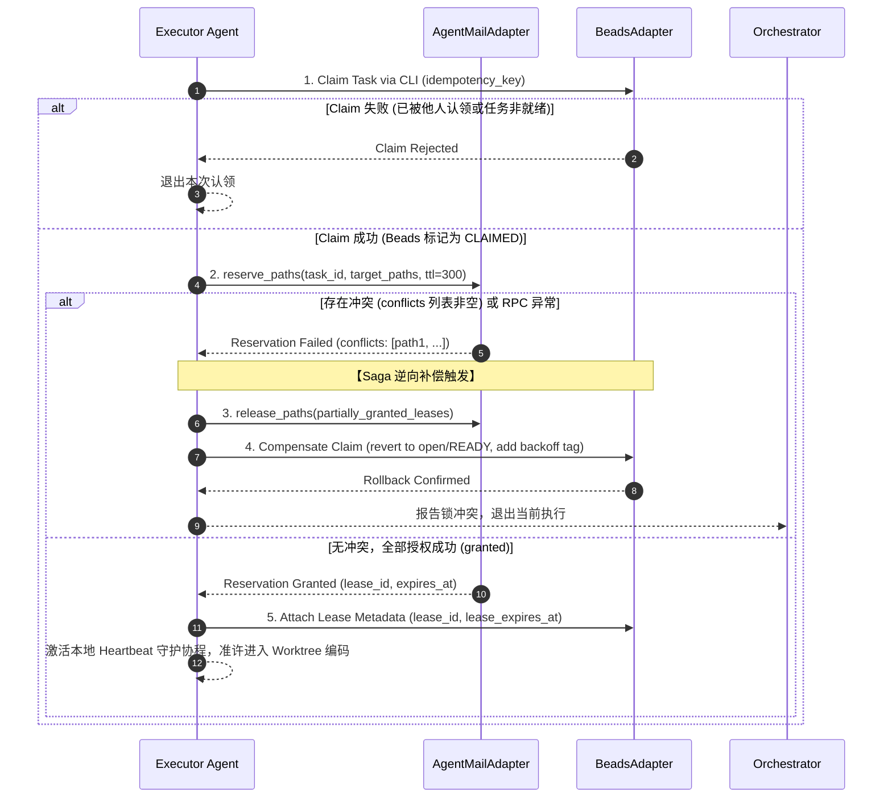
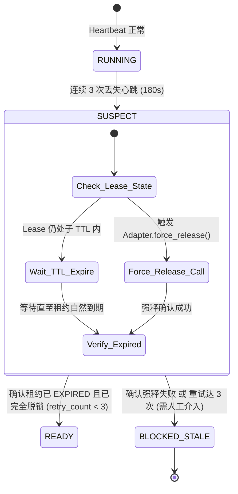
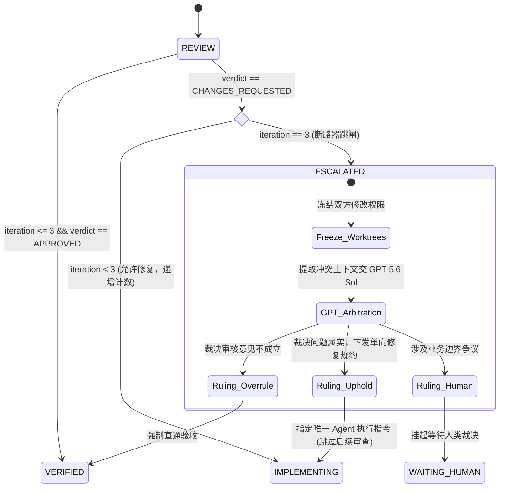

# AI Engineering Orchestrator 架构补充规范 (v1.1)
### Engineering Reliability Addendum / 工程可靠性补充规范

> **定位声明**：本规范作为 `AI_Engineering_Orchestrator_实施方案_v1.0` 的**工程可靠性补充规范**，用于固化分布式协作边界。
> 本规范不推翻 v1.0 的总体架构，重点对租约劝告语义、Saga 补偿、双阶段自愈、强类型 JSON DTO、审查熔断、Worktree 现场保留及 Beads 粗细粒度映射进行生产级约束。

---

## 目录
1. [规范定位与核心约束原则](#1-规范定位与核心约束原则)
2. [幂等性与操作指纹契约 (Idempotency Contract)](#2-幂等性与操作指纹契约-idempotency-contract)
3. [任务认领与劝告性租约 Saga (Claim + Advisory Lease Saga)](#3-任务认领与劝告性租约-saga-claim--advisory-lease-saga)
4. [心跳、两阶段僵尸自愈与 Adapter 契约 (Heartbeat & Two-Phase Recovery)](#4-心跳两阶段僵尸自愈与-adapter-契约-heartbeat--two-phase-recovery)
5. [跨 Agent 机器可验证契约 (Machine-Readable JSON DTOs)](#5-跨-agent-机器可验证契约-machine-readable-json-dtos)
6. [审查循环熔断器与仲裁机制 (Review Circuit Breaker & Arbitration)](#6-审查循环熔断器与仲裁机制-review-circuit-breaker--arbitration)
7. [Worktree 资源策略、pnpm 共享存储与现场保留机制](#7-worktree-资源策略pnpm-共享存储与现场保留机制)
8. [Beads 粗细粒度状态映射与 CLI 补偿规约](#8-beads-粗细粒度状态映射与-cli-补偿规约)
9. [故障恢复矩阵 (Failure & Recovery Matrix)](#9-故障恢复矩阵-failure--recovery-matrix)
10. [P0 准入前置核查表 (Pre-P0 Gate Checklist)](#10-p0-准入前置核查表-pre-p0-gate-checklist)

---

## 1. 规范定位与核心约束原则

### 1.1 术语解构 (Cognitive Acceleration)
- `Advisory Lease = Advisory (劝告性的/依赖自觉约定的) + Lease (有期租约)`：非操作系统内核级的硬锁。它依赖 Agent 遵守协作协议，以及 Git Hook 进行提交时校验；只要存在潜在冲突，Agent 必须主动放弃执行。
- `Saga Compensation = Saga (长事务编排) + Compensation (反向冲正/补偿)`：在缺乏跨服务 ACID 事务时，一旦下游步骤失败，通过执行预设的逆向操作来恢复系统一致性。
- `Circuit Breaker = Circuit (回路) + Breaker (断路跳闸器)`：在审查循环超过阈值时强行熔断回旋，把控制权收归高阶裁决者，杜绝 Token 活锁黑洞。
- `Forensic Retention = Forensic (取证/现场勘验) + Retention (留存策略)`：异常崩溃或冲突挂起的工作目录严禁直接抹除，必须先保存现场 patch 与元数据后再按 TTL 回收。

### 1.2 核心约束原则
1. **劝告租约零侥幸**：Agent Mail 提供的文件预约是 Advisory 语义。一旦返回 `conflicts` 列表非空，整体申请立刻判负，禁止在存在冲突的文件上动笔。
2. **两阶段自愈（Two-Phase Recovery）**：失联任务绝不直接跳回 `READY`。必须先进入 `SUSPECT` 隔离区，确认旧租约已 `EXPIRED` 或被成功 `force-release` 后，才准许重新派发。
3. **消除虚构 RPC，依循 Adapter 契约**：所有对外依赖（Beads CLI、Agent Mail MCP）均通过薄层 Adapter 抽象，禁止调用未经证实的虚构 REST 接口，禁止越过 CLI 直接暴力修改底库。
4. **强类型数据交换**：跨 Agent 协作必须携带强类型 JSON Envelope 与 Payload，禁止自然语言自由交接。

---

## 2. 幂等性与操作指纹契约 (Idempotency Contract)

为杜绝网络重试、Agent 崩溃重启导致的任务重复认领或重复执行，跨 Agent 的所有状态变更调用必须传递统一的操作指纹：

```
+-------------------------------------------------------------------------------+
| operation_id   : UUIDv7 (单调递增，毫秒时间戳前缀，便于按时间序审计)                |
| idempotency_key: 格式规范为 <source_agent>:<action>:<task_id>:<sequence_num>   |
+-------------------------------------------------------------------------------+
```

### 2.1 业务幂等键映射表
| 操作类型 (action) | idempotency_key 格式规范 | 典型示例 |
| :--- | :--- | :--- |
| 任务认领 (claim) | `<agent>:claim:<task_id>:<epoch>` | `agent_zcode:claim:bd-a3f8e9:1` |
| 文件预约 (reserve) | `<agent>:reserve:<task_id>:<files_hash>` | `agent_zcode:reserve:bd-a3f8e9:7f81b` |
| 代码交付 (handover) | `<agent>:handover:<task_id>:<head_commit>` | `agent_zcode:handover:bd-a3f8e9:a1b2c3d`|
| 审查判定 (review) | `<agent>:review:<task_id>:<iteration>` | `agent_antigravity:review:bd-a3f8e9:2`  |
| 仲裁裁决 (arbitrate)| `gpt_orchestrator:arbitrate:<task_id>:<seq>` | `gpt_orchestrator:arbitrate:bd-a3f8e9:1`|
| 释放租约 (release) | `<agent>:release:<task_id>:<lease_id>` | `agent_zcode:release:bd-a3f8e9:ls-9912` |

### 2.2 服务端幂等处理规约
- 接入层维护滑动去重窗口（默认保留 24 小时）：
  `{ idempotency_key, operation_id, status: PENDING|SUCCESS|FAILED, response_cache, updated_at }`
- **并发互斥**：若接收到相同 `idempotency_key` 且处于 `PENDING`，返回 `409 Conflict (Operation in Progress)`；
- **重放命中**：若已为 `SUCCESS`，直接返回已缓存的 `response_cache`，底层不重复执行物理操作。

---

## 3. 任务认领与劝告性租约 Saga (Claim + Advisory Lease Saga)

### 3.1 劝告性租约裁决规则
Agent Mail 的文件预约不具备操作系统内核锁特性，因此系统做如下强约束：
1. Agent 调用 `AgentMailAdapter.reserve_paths()`；
2. 若响应中 `conflicts` 列表非空（即任何目标文件处于被他人占用或未释放状态）：
   - **本次申请整体视为彻底失败**；
   - 立即释放本次调用中已部分授予的任何临时 reservations；
   - 执行 Beads 认领补偿（将 Task 退回 `open / READY`）；
   - 执行退避等待（Initial 30s，指数递增，最大 5m）；
   - **绝对禁止 Agent 进入 Worktree 修改任何代码**。

### 3.2 Saga 流转时序拓扑



### 3.3 补偿规则矩阵
| 场景代号 | 故障切入点 | 瞬时脏状态 | 补偿动作 (Saga Compensation) | 收敛目标状态 |
| :--- | :--- | :--- | :--- | :--- |
| **S-01** | Claim 成功，但 Reserve 发生 conflict | Beads: CLAIMED<br>Mail: 无租约/部分脏租约 | 1. 清理本次部分 granted 租约<br>2. CLI 补偿将 Beads 任务状态回滚至 `open`<br>3. 增加递增退避惩罚时间 | Beads: `open`<br>Mail: 无锁定 |
| **S-02** | Claim 与 Reserve 均成功，Agent 随后闪退 | Beads: CLAIMED<br>Mail: 租约有效但无心跳 | 进入两阶段自愈：等待 TTL 超时或 Reaper 确认租约过期，再行回滚 | 见第 4 节自愈流程 |
| **S-03** | 编码/自测执行期发生致命异常 | Beads: IMPLEMENTING<br>Mail: 租约有效 | 1. 显式调用 `AgentMailAdapter.release_reservation()`<br>2. Beads 打上 `stage:FAILED`，保留现场证据 | Beads: `blocked`<br>Mail: RELEASED |
| **S-04** | 任务完成，Release 调用网络超时 | Beads: VERIFIED<br>Mail: 租约残留 | 后台重试 3 次；若不可达，交由 TTL 自然到期释放，不阻断主流程 | Beads: `closed`<br>Mail: EXPIRED |

---

## 4. 心跳、两阶段僵尸自愈与 Adapter 契约 (Heartbeat & Two-Phase Recovery)

### 4.1 核心参数定义
- $T_{\text{lease}}$ (租约时长)：默认 `300 秒` (5 分钟)。
- $T_{\text{hb\_interval}}$ (心跳周期)：`60 秒`。
- $T_{\text{hb\_step}}$ (单次续租步进)：向后追加延展 `+300 秒`。
- $T_{\text{timeout}}$ (判定失联阈值)：`180 秒` (连续 3 次心跳丢失)。

### 4.2 Adapter Contract (非虚构真实适配层接口)
禁止使用未经验证的 REST 接口（如 `POST /mail/lease/keepalive`），系统通过 Adapter 抽象调用：

```python
class AgentMailAdapter:
    def reserve_paths(self, agent_id: str, task_id: str, paths: list[str], ttl_seconds: int = 300) -> ReservationResult:
        """申请文件预约，返回包含 is_granted, lease_id, conflicts 的结构体"""
        ...
        
    def renew_lease(self, lease_id: str, task_id: str, ttl_seconds: int = 300) -> bool:
        """基于当前 Agent Mail 能力执行续租，返回是否续租成功"""
        ...
        
    def release_reservation(self, lease_id: str, task_id: str) -> bool:
        """主动归还租约"""
        ...
        
    def force_release_reservation(self, lease_id: str, reason: str) -> bool:
        """管理端/自愈器调用的强制释放接口"""
        ...
```

### 4.3 两阶段僵尸自愈流程 (Two-Phase Stale Recovery)
严禁在检测到心跳丢失后直接把任务重置为 `READY`（防止老 Agent 处于 STW 假死后恢复写穿代码）。



1. **第一阶段 (QUARANTINE / 隔离判定)**：
   - 当任务失联超过 180s，任务状态跃迁至 `SUSPECT` / `BLOCKED_STALE`；
   - 调度系统停止向该 Agent 发送指令，隔离现场。
2. **第二阶段 (VERIFY & DRAIN / 排水确认)**：
   - 检查 Agent Mail 租约是否已过 TTL，或调用 `force_release_reservation()`；
   - 只有**确凿证实旧租约已被注销/过期**后，才允许把 Beads 任务标签重置回 `READY`，供后续认领。

---

## 5. 跨 Agent 机器可验证契约 (Machine-Readable JSON DTOs)

所有交互消息在 Agent Mail 中必须作为 JSON 结构体或标准化 Frontmatter 载荷进行投递与反序列化校验。

### 5.1 通用消息信封 (AgentMessageEnvelope)
```json
{
  "$schema": "https://json-schema.org/draft/2020-12/schema",
  "title": "AgentMessageEnvelope",
  "type": "object",
  "required": [
    "schema_version",
    "message_id",
    "operation_id",
    "idempotency_key",
    "task_id",
    "sender",
    "recipient",
    "message_type",
    "timestamp",
    "payload"
  ],
  "properties": {
    "schema_version": { "type": "string", "const": "1.1.0" },
    "message_id": { "type": "string", "pattern": "^msg-[0-9a-f]{12}$" },
    "operation_id": { "type": "string", "pattern": "^[0-9a-f]{8}-[0-9a-f]{4}-7[0-9a-f]{3}-[89ab][0-9a-f]{3}-[0-9a-f]{12}$" },
    "idempotency_key": { "type": "string", "minLength": 8 },
    "task_id": { "type": "string", "pattern": "^bd-[0-9a-z]{6,10}$" },
    "sender": { "type": "string", "enum": ["gpt_orchestrator", "agent_zcode", "agent_antigravity", "human"] },
    "recipient": { "type": "string", "enum": ["gpt_orchestrator", "agent_zcode", "agent_antigravity", "human"] },
    "message_type": {
      "type": "string",
      "enum": ["HANDOVER_FOR_REVIEW", "REVIEW_VERDICT", "ARBITRATION_DECISION", "HEARTBEAT_STATUS"]
    },
    "timestamp": { "type": "integer", "description": "Epoch ms" },
    "payload": { "type": "object" }
  },
  "additionalProperties": false
}
```

### 5.2 任务交付 Payload 契约 (TaskHandoverPayload)
```json
{
  "$schema": "https://json-schema.org/draft/2020-12/schema",
  "title": "TaskHandoverPayload",
  "type": "object",
  "required": [
    "iteration",
    "git_context",
    "affected_files",
    "test_evidence",
    "deliverable_summary"
  ],
  "properties": {
    "iteration": { "type": "integer", "minimum": 1, "maximum": 3 },
    "git_context": {
      "type": "object",
      "required": ["worktree_path", "branch_name", "base_commit", "head_commit"],
      "properties": {
        "worktree_path": { "type": "string" },
        "branch_name": { "type": "string", "pattern": "^agent/[a-z0-9_-]+/bd-[0-9a-z]+$" },
        "base_commit": { "type": "string", "pattern": "^[0-9a-f]{7,40}$" },
        "head_commit": { "type": "string", "pattern": "^[0-9a-f]{7,40}$" }
      }
    },
    "affected_files": {
      "type": "array",
      "items": { "type": "string" },
      "minItems": 1
    },
    "test_evidence": {
      "type": "object",
      "required": ["command", "exit_code", "total_tests", "passed_tests", "failed_tests", "output_summary"],
      "properties": {
        "command": { "type": "string" },
        "exit_code": { "type": "integer" },
        "total_tests": { "type": "integer", "minimum": 0 },
        "passed_tests": { "type": "integer", "minimum": 0 },
        "failed_tests": { "type": "integer", "minimum": 0 },
        "output_summary": { "type": "string", "maxLength": 2048 }
      }
    },
    "deliverable_summary": { "type": "string", "maxLength": 4096 }
  },
  "additionalProperties": false
}
```

### 5.3 审查结论 Payload 契约 (ReviewReportPayload)
```json
{
  "$schema": "https://json-schema.org/draft/2020-12/schema",
  "title": "ReviewReportPayload",
  "type": "object",
  "required": [
    "verdict",
    "iteration",
    "verified_head_commit",
    "findings"
  ],
  "properties": {
    "verdict": {
      "type": "string",
      "enum": ["APPROVED", "CHANGES_REQUESTED", "FATAL_REJECT"]
    },
    "iteration": { "type": "integer", "minimum": 1, "maximum": 3 },
    "verified_head_commit": { "type": "string", "pattern": "^[0-9a-f]{7,40}$" },
    "findings": {
      "type": "array",
      "items": {
        "type": "object",
        "required": ["severity", "file_path", "line_number", "issue_type", "description", "actionable_fix"],
        "properties": {
          "severity": { "type": "string", "enum": ["BLOCKER", "CRITICAL", "MAJOR", "TRIVIAL"] },
          "file_path": { "type": "string" },
          "line_number": { "type": "integer" },
          "issue_type": { "type": "string", "enum": ["LOGIC_BUG", "SECURITY_RISK", "TEST_MISSING", "STYLE_DRIFT"] },
          "description": { "type": "string", "maxLength": 1024 },
          "actionable_fix": { "type": "string", "maxLength": 2048 }
        }
      }
    },
    "blocking_count": { "type": "integer", "minimum": 0 }
  },
  "additionalProperties": false
}
```

### 5.4 GPT 仲裁裁决 Payload 契约 (ArbitrationResultPayload)
```json
{
  "$schema": "https://json-schema.org/draft/2020-12/schema",
  "title": "ArbitrationResultPayload",
  "type": "object",
  "required": [
    "arbitration_id",
    "task_id",
    "ruling",
    "rationale",
    "binding_directives",
    "designated_executor"
  ],
  "properties": {
    "arbitration_id": { "type": "string", "pattern": "^arb-[0-9a-f]{10}$" },
    "task_id": { "type": "string", "pattern": "^bd-[0-9a-z]{6,10}$" },
    "ruling": {
      "type": "string",
      "enum": ["OVERRULE_REVIEWER_ACCEPT", "UPHOLD_REVIEWER_REVISE", "SUSPEND_FOR_HUMAN"]
    },
    "rationale": { "type": "string", "maxLength": 2048 },
    "binding_directives": {
      "type": "array",
      "items": { "type": "string" },
      "minItems": 1
    },
    "designated_executor": { "type": "string", "enum": ["agent_zcode", "agent_antigravity", "human"] },
    "target_commit": { "type": "string" }
  },
  "additionalProperties": false
}
```

---

## 6. 审查循环熔断器与仲裁机制 (Review Circuit Breaker & Arbitration)

### 6.1 审查循环硬阈值
- `ReviewReportPayload.iteration` 严格限制在 `1..3`。
- 一旦第 3 轮审查结果仍然是 `CHANGES_REQUESTED`，**断路器立即跳闸**：
  - 禁止任务再次流转回 `IMPLEMENTING` 进行私下回旋；
  - 任务状态直接迁跃为 `ESCALATED`；
  - 触发 `ArbitrationResultPayload` 仲裁流程。

### 6.2 断路流转拓扑



---

## 7. Worktree 资源策略、pnpm 共享存储与现场保留机制

### 7.1 Reusable Worktree 拓扑与分支规则
- 默认采用 `PER_AGENT reusable worktree`（如 `worktrees/agent-zcode` 与 `worktrees/agent-antigravity`）。
- **取消“每次必须 checkout main”的要求**：
  - 频繁切换到 `main` 容易引入分支切换脏写与锁竞争；
  - 规则：Agent 工作在专有 Worktree 内，直接基于远端 `origin/main` 切出或更新本地特性分支：
    ```bash
    git fetch origin main:origin/main --prune
    git checkout -B agent/zcode/<task-id> origin/main
    ```

### 7.2 依赖缓存共享规范 (杜绝长期保留脏 node_modules)
- **严禁把“长期保留各 Worktree 内的 node_modules”作为缓存策略**：避免历史残留包污染依赖树。
- **共享 pnpm store，不共享 node_modules**：
  - 各工作目录通过全局只读的 pnpm store 建立硬链接（Hard Links）：
    ```bash
    pnpm config set store-dir /shared/cache/.pnpm-store
    ```
  - 安装依赖时由 pnpm 秒级创建硬链接，既零重复占用磁盘，又确保每个 Worktree 的依赖树纯净。
- **Java / Maven 共享存储**：
  - 统一指向只读/并发安全的 Local Repository：
    `-Dmaven.repo.local=/shared/cache/.m2/repository`

### 7.3 异常工作区“现场保留机制” (Forensic Retention Policy)
对于执行失败（FAILED）、心跳丢失（SUSPECT）或合并冲突（BLOCKED）的 Worktree，**严禁执行立即物理强制删除 (`rm -rf` / `git worktree remove --force`)**。

必须执行如下现场保护 SOP：
1. **生成现场取证包**：
   - 提取未提交现场：`git diff HEAD > failure_artifacts/<task-id>.patch`
   - 保存未跟踪文件清单：`git status --porcelain > failure_artifacts/<task-id>.status`
   - 保存构建与测试控制台输出：`failure_artifacts/<task-id>.log`
2. **打上归档标签**：
   - 生成现场分支 `archive/failed/<task-id>-<timestamp>` 并推送到本地/远端；
3. **延迟清理策略 (Retention TTL)**：
   - 失败现场在磁盘保留 `72 小时`；
   - 超出 72 小时或物理磁盘空间低于 15% 时，由清理脚本统一回收。

---

## 8. Beads 粗细粒度状态映射与 CLI 补偿规约

### 8.1 严禁绕过 CLI 直接侵入底库
- **严禁直接通过 SQL 或文件操作去修改 Beads 底层的 Dolt 或 SQLite 数据库**。
- 所有任务认领、流转、补偿均调用官方公开的 CLI 命令或标准化 API。

### 8.2 状态映射规范：粗粒度归 Beads，细粒度归 Labels/Metadata
为了保持与 Beads 原生生态（DAG、Ready Queue、依赖判定）的完全兼容，采用分层状态映射：

| 工程全流程状态 | Beads 原生 Status (粗粒度) | Beads Labels / Metadata (细粒度) | 说明 |
| :--- | :--- | :--- | :--- |
| **BACKLOG / READY** | `open` | `stage:READY` | 依赖已就绪，进入 Ready Queue |
| **CLAIMED** | `in_progress` | `stage:CLAIMED`, `owner:<agent>`, `lease_id:<id>` | 已被认领，文件预约中 |
| **IMPLEMENTING** | `in_progress` | `stage:IMPLEMENTING`, `iteration:1` | 代码编写中 |
| **SELF_TEST** | `in_progress` | `stage:SELF_TEST` | 本地自测中 |
| **REVIEW** | `in_progress` | `stage:REVIEW`, `reviewer:<agent>` | 处于独立交叉审查期 |
| **SUSPECT** | `blocked` | `stage:SUSPECT`, `reason:HEARTBEAT_LOST` | 失联两阶段自愈隔离态 |
| **ESCALATED** | `blocked` | `stage:ESCALATED`, `circuit:TRIPPED` | 审查熔断，移交仲裁 |
| **VERIFIED** | `in_progress` | `stage:VERIFIED`, `approver:<agent>` | 审查通过，待合并代码 |
| **MERGED / DONE** | `closed` | `stage:DONE` | 代码合流完毕，任务终结 |

### 8.3 CLI 逆向补偿命令标准
当 Saga 触发补偿（如 Reserve 冲突失败需要撤销 Claim）时，Adapter 执行：
```bash
# 1. 恢复状态回 open
bd update <task-id> --status open
# 2. 移除细粒度执行人与占用标记，打入退避惩罚标签
bd label remove <task-id> stage:CLAIMED owner:agent_zcode
bd label add <task-id> stage:READY backoff_until:<timestamp>
```

---

## 9. 故障恢复矩阵 (Failure & Recovery Matrix)

| 场景编号 | 故障表象 | 根因分类 | 自动化检测手段 | 系统自愈/恢复措施 | 最终兜底措施 |
| :--- | :--- | :--- | :--- | :--- | :--- |
| **F-01** | Reserve 返回 `conflicts` | 文件已被他人抢先预约 | AgentMailAdapter 返回非空 conflicts 列表 | 自动撤销本次所有已赋租约，触发 Beads CLI 补偿回滚，执行退避算法 | 连续退避超 15 分钟上报 Orchestrator 调序 |
| **F-02** | Agent 心跳丢失 (180s) | 进程崩溃 / OOM / 阻塞 | 心跳监控协程超时未收到信号 | 跃迁入 `SUSPECT` 隔离区；确认租约自然到期或强释后，重置任务回 `READY` | 重试 3 次均崩溃置为 `BLOCKED_NEED_HUMAN` |
| **F-03** | 审查循环达到 3 次 | Agent 间工程审美/实现分歧 | `iteration == 3` 且收到 `CHANGES_REQUESTED` | 断路器跳闸触发 `ESCALATED`，生成争议上下文呼叫 GPT-5.6 Sol 裁决 | GPT 给出终局裁决或挂起待人工介入 |
| **F-04** | Git Worktree 报合并冲突 | 依赖主干漂移产生 Conflict | `git merge` 返回非零退出码 | 现场保护 SOP：导出 patch，挂起 Worktree，创建专门解冲突 Task | 无法自动 Rebase 则交由人工合并 |
| **F-05** | 磁盘剩余低于 15% | 多任务并发/缓存膨胀 | 磁盘空间水位探测脚本 | 阻止一切新任务认领，清理 >72 小时 FAILED 归档与非活跃 Worktree | 告警通知管理员扩容磁盘 |
| **F-06** | 交付消息 Schema 校验未过 | Payload 缺失必填字段 | 接入层 JSON Schema Validator 拦截 | 返回 `400 Bad Schema` 附带详细 path 报错，要求发送方重新格式化重投 | 连续 2 次格式错误直接判定任务 FAILED |

---

## 10. P0 准入前置核查表 (Pre-P0 Gate Checklist)

在进入任何代码编写与组件安装前，必须确认以下 5 项条件全部打钩：
- [x] **架构设计与可靠性契约**：`architecture_spec_v1.1.md` 已吸收全部修正并定稿。
- [ ] **组件接口能力核实**：确认本地已安装的 Beads 与 Agent Mail CLI/MCP 工具签名与 Adapter Contract 对齐。
- [ ] **物理路径与权限规范**：明确 `/shared/cache/.pnpm-store` 与 `~/.m2/repository` 在开发机上的真实可写路径。
- [ ] **Schema 验证器基座**：确认用于校验 Envelope 与 Payload 的 Python/Node 依赖具备 Draft 2020-12 支持能力。
- [ ] **Git Hook 规范准备**：预先准备好基于文件预约状态的 `pre-commit` 拦截脚本模板。
